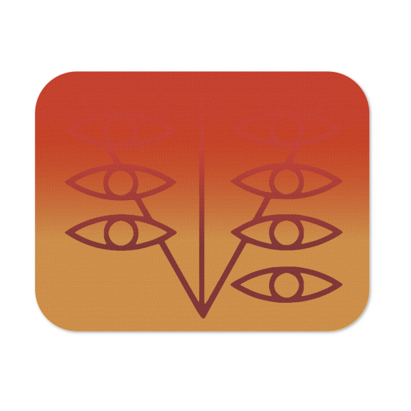

<div align="center">

<h1>Tokyo-3</h1>
<p>
<b> High-Quality Terminal Based Pomodoro Timer with Ending Animations. </b>
</p>
<br/>
<br/>
<br/>
</div>

This is a terminal based pomodoro timer. The Pomodoro technique is a time management method developed in the 1980s by Cirllio Francesco. This timer has the added design of NGE themed colors and ending Animations.

<div align="center">

</div>

## Install

Tokyo-3 requires Node.js runtime. As there are numerous ways to install Node I'll just recommend a few, all are viable although I prefer NVM.

Direct from Node
<br/>
[NODE](https://nodejs.org/en/download/)

Mac/Linux (Preferred)
<br/>
[NVM](https://github.com/nvm-sh/nvm)
<br/>
[n](https://github.com/tj/n)

Windows (Preferred)
<br/>
[NVM-windows](https://github.com/coreybutler/nvm-windows)
<br/>
[nodist](https://github.com/nullivex/nodist)

After NODE is installed you should be able to install TOKYO-3 with the following command in your terminal.
<br/>

```
npm install -g tokyo-3
```

## Usage

`tokyo --min [duration] --color [color]`

Example: 5 minute timer with no ending animation.

```
 tokyo --min 5
```

Example: 5 minute timer with penguin(Penpen) ending animation.

```
tokyo --min 5 --color pen
```

## Options

Show Help Menu <br/>
`tokyo --help`

### Duration

Duration is always in minutes, if you want a timer for 1 hour 5 minutes it will be entered as `--min 65`

If no duration is specified it will default to 15 minutes.

### Colors

The color options are as follows

```
red
green
angel
beast
shinji
rei
pen
gendo
nerv
random
```

### Animations

Animations are linked to their corresponding color. The green and random color options have no animations.

## Tips & Tricks

Replay last command in the command line. <br/>
`!!` or press up on your keyboard

Have a specific time you want quick access to? Add it to your .bashrc or .zshrc <br/>
In your .bashrc

```
alias timer='tokyo --min 15 --color pen'
```

## Trouble Shooting

The most common problem will likely be slow rendering. Mac and Windows operating systems come installed with ineffecient Terminals. If you are on a Mac I highly recommend [Alacritty](https://github.com/alacritty/alacritty) or [Kitty](https://sw.kovidgoyal.net/kitty/), both utilize gpu leveraging, you will see a signifcant performance boost even with intergrated graphics like that of Macbooks and Macbook Airs. If you are on a Windows system the same can be said. If you are on Linux Gnome terminal is already fairly powerful and comes installed on most distros.

Also of note is that both Kitty and Alacritty have great color themes and options to adjust render timings.

If you would rather not get your hands dirty with config files you can also use color "red" as I specifically slowed the clock and animation speed to accomodate underpowered machines.

## Special Thanks

Dominik Wilkowski & the [cfonts](https://github.com/dominikwilkowski/cfonts) team. <br/>
Aria - for your infinite wisdom. <br/>
Aya - We Live in a Twilight World. <br/>
Juneau - You're a dog.

## Liscense

MIT
